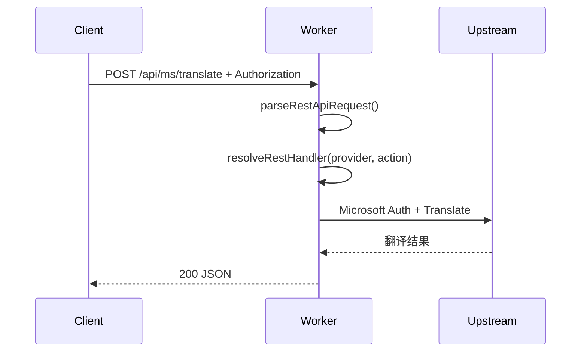

# PubAPI 开发文档

## 1. 目标与边界
- 目标: 在不破坏现有 OpenAI 风格端点(` /v1/models`,`/v1/chat/completions`,`/v1/audio/speech`)的前提下，新增标准 RESTful 访问端点 `GET|POST /api/{provider}/{action}`。
- 边界:
  - 仅做路由与参数映射，不新增任何上游业务能力。
  - 鉴权规则与旧端点保持一致(除 `OPTIONS` 与 `/v1/models` 外均需 API Key)。
  - `POST /v1/chat/completions` 响应为标准 OpenAI Chat Completions 结构，不再透传上游原始 JSON。

## 2. 用户用例图
```mermaid
flowchart LR
  U[客户端用户] --> A[调用 /api/{provider}/{action}]
  A --> B{鉴权通过?}
  B -- 否 --> E[401 错误返回]
  B -- 是 --> C{路由存在?}
  C -- 否 --> F[404 错误返回]
  C -- 是 --> D[调用既有 provider 函数]
  D --> G[标准 JSON/音频响应]
```

## 3. 时序图


## 4. 流程图
```mermaid
flowchart TD
  S[收到请求] --> M{OPTIONS?}
  M -- 是 --> O[204 + CORS]
  M -- 否 --> V{pathname=/v1/models && GET?}
  V -- 是 --> L[返回模型列表]
  V -- 否 --> K{API Key 有效?}
  K -- 否 --> U[返回 401]
  K -- 是 --> R{命中 /api/{provider}/{action}?}
  R -- 是 --> H[handleRestApi()]
  R -- 否 --> T{命中旧路由?}
  T -- 是 --> X[handleChat/handleTTS]
  T -- 否 --> N[返回 404]
```

## 5. 数据结构定义

### 5.1 RestRouteMatch
- 含义: `/api/{provider}/{action}` 的解析结果。
- 字段:
  - `provider: string`
    - 含义: 平台标识。
    - 用法: 用于路由分发。
    - 边界: 非空，示例: `gg`,`ms`,`iciba`,`youdao`,`google`,`microsoft`。
  - `action: string`
    - 含义: 功能动作标识。
    - 用法: 与 provider 组合决定调用函数。
    - 边界: 非空，示例: `tts`,`translate`,`dict`,`suggest`。

### 5.2 RestInput
- 含义: REST 端点统一参数对象，来自 query 和/或 JSON body。
- 字段:
  - `text: string`
    - 含义: 输入文本。
    - 用法: 词典/翻译/TTS 的主要输入。
    - 边界: 必填(对所有 action)。
  - `source_lang: string`
    - 含义: 源语言。
    - 用法: 翻译场景。
    - 边界: 默认 `auto`。
 - `target_lang: string`
    - 含义: 目标语言。
    - 用法: 翻译场景，且在 `/api/gg/tts` 中作为 Google TTS 的语言参数。
    - 边界: 默认 `zh`。
  - `voice: string`
    - 含义: 仅旧 `/v1/audio/speech` 使用的 TTS 语音/语言代码。
    - 用法: 非 RESTful 参数。
    - 边界: RESTful 层不接收该字段。
  - `speed: number`
    - 含义: TTS 语速。
    - 用法: Google TTS。
    - 边界: 默认 `1.0`。
  - `type: number`
    - 含义: 发音类型。
    - 用法: 有道/词霸 TTS。
    - 边界: `1|2`，默认 `1`。
  - `nums: number`
    - 含义: 联想数量。
    - 用法: suggest。
    - 边界: 正整数，默认 `5`。

## 6. API 定义

### 6.1 新增 API
1. `GET|POST /api/gg/tts`
2. `GET|POST /api/google/tts`
3. `GET|POST /api/ms/translate`
4. `GET|POST /api/microsoft/translate`
5. `GET|POST /api/iciba/dict`
6. `GET|POST /api/iciba/suggest`
7. `GET|POST /api/iciba/tts`
8. `GET|POST /api/youdao/dict`
9. `GET|POST /api/youdao/suggest`
10. `GET|POST /api/youdao/tts`
11. `GET|POST /api/gg/translate`
12. `GET|POST /api/gg/dict`

### 6.2 输入
- Header:
  - `Authorization: Bearer <API_KEY>` 或 `X-API-Key: <API_KEY>`
- Query(推荐 GET) 或 JSON Body(推荐 POST):
  - `text, source_lang, target_lang, speed, type, nums`

### 6.3 输出
- 成功:
  - `POST /v1/chat/completions`:
    - `id: string`
    - `object: "chat.completion"`
    - `created: number` (Unix 秒级时间戳)
    - `model: string`
    - `choices: [{ index: number, message: { role: "assistant", content: string }, finish_reason: "stop" }]`
    - `usage: { prompt_tokens: number, completion_tokens: number, total_tokens: number }`
  - JSON 能力统一结构 (`/api/*/*` 的 translate/dict/suggest，以及 `POST /v1/chat/completions` 的 `message.content` 序列化后):
    - `text: string`（已处理、可直接展示/消费）
    - `raw: object|array`（上游原始响应）
  - `GET|POST /api/gg/dict`:
    - `text` 会按“释义、词性候选、例句”进行整理
    - `raw` 为 Google 原始词典响应
  - `GET|POST /api/youdao/dict`:
    - `text` 会按“单词、音标、词性释义、网络释义”整理
    - `raw` 为有道原始词典响应
  - `GET|POST /api/iciba/dict`:
    - `text` 会按“单词、音标、词性释义、例句”整理
    - `raw` 为词霸原始词典响应
  - `GET|POST /api/youdao/suggest` 与 `GET|POST /api/iciba/suggest`:
    - `text` 会按“候选词 + 简述释义”逐行整理
    - `raw` 为各自原始联想响应
  - 音频流: TTS
- 失败:
  - `{"error": string, "status": number}`

## 7. 函数签名清单

1. `function matchRestApiPath(pathname: string): RestRouteMatch | null`
   - 异常/错误: 无抛出，失败返回 `null`。
2. `async function parseRestInput(request: Request): Promise<RestInput | {error: Response}>`
   - 异常/错误: JSON 非法时返回错误响应包装。
3. `async function handleRestApi(request: Request, pathname: string): Promise<Response>`
   - 异常/错误: 参数缺失、路由不支持、上游失败时返回错误响应。
4. `function buildMsMessages(text: string): Array<{content: string}>`
   - 异常/错误: 无。
5. `function toNumber(value: unknown, fallback: number): number`
   - 异常/错误: 无；`NaN` 时回退默认值。

## 8. 伪代码
```text
if request is OPTIONS:
  return 204
if request is /v1/models GET:
  return model list
if api key invalid:
  return 401
if path matches /api/{provider}/{action}:
  parse input from query + body
  switch provider/action:
    gg+tts -> googleTTS
    ms+translate -> microsoftTranslate
    iciba+dict -> icibaDict
    ...
  return response
fallback to legacy /v1/* routes
```

## 9. 表结构
- 当前需求不引入 D1 持久化，不新增数据表。
- 现有 `env` 字段:
  - `API_KEY: string`，用于请求鉴权。
